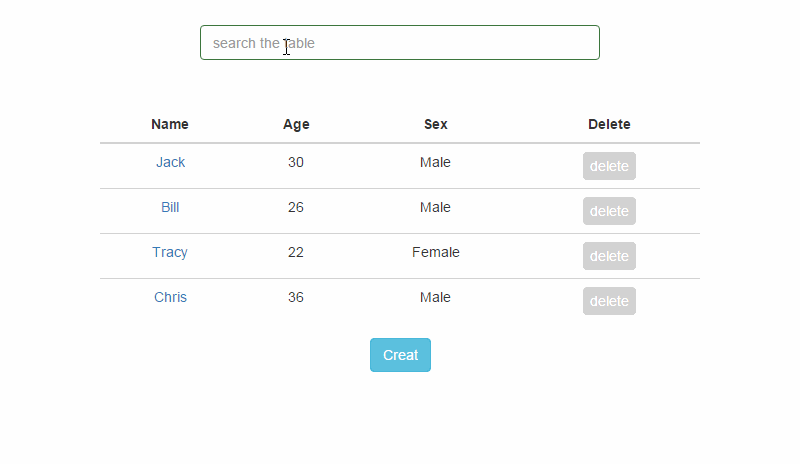
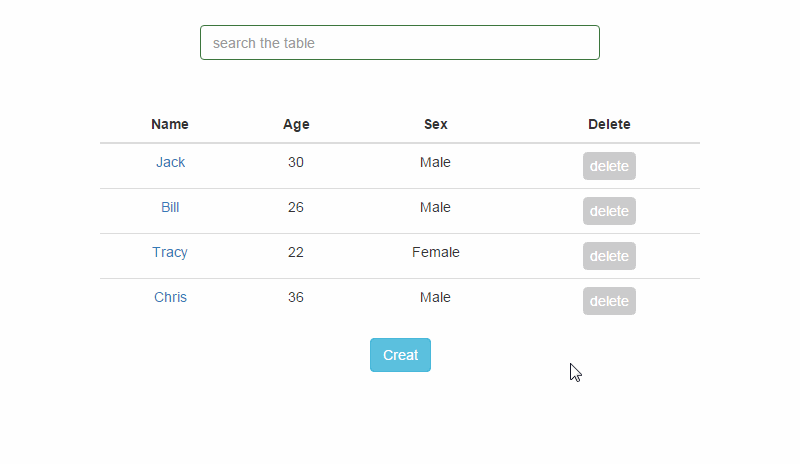
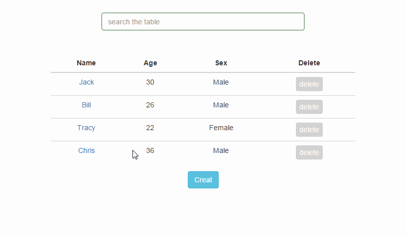

# vue-info-card

用vue写的入门级表格组件，[demo在此](https://therefor.github.io/vue-info-card/)。

>支持全字段filter检索

>可删除或增加条目

>点击名字可修改信息

#### 原版是keepfool[用Vue 1.0所写](http://www.cnblogs.com/keepfool/p/5637834.html)，Vue2.0以后版本废除了filter和dispatch等功能，这里用vue 2.0 重写了父子组件的通信部分和过渡动画，在此感谢keepfool!